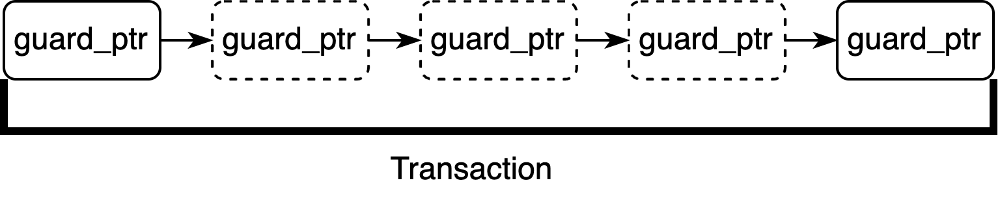
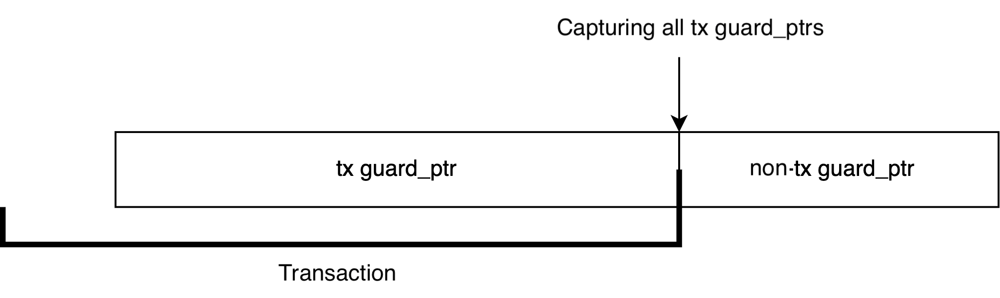
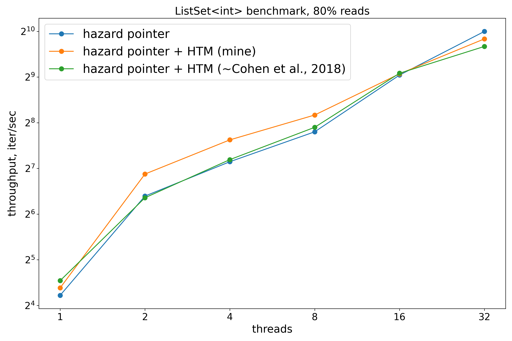
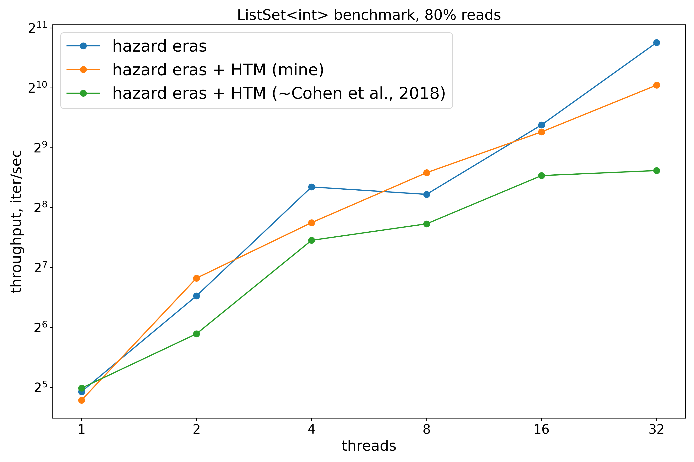

# Lock-free memory reclamation using Hardware Transactional Memory

**TL;DR:** Adapted **ad-hoc** HTM-based memory reclamation scheme for a **scheme-agnostic** reclamation framework [xenium](https://github.com/mpoeter/xenium) by introducing **low-overhead** hazard-pointer tracking in transactions.

## Intro

### xenium

General framework that allows reclamation-scheme-agnostic code by providing the following interface:

- marked\_ptr - allows borrowing unutilized bits of the pointer
- concurrent\_ptr - atomic\<marked\_ptr\>; translates into weak\_ptr in C++ memory management
- guard\_ptr - allows to atomically capture concurrent\_ptr and guarantee that the node won't be deleted; translates into shared\_ptr in C++

Also introduces region\_guard, which

- is created when entering *critical region* 
- allows implementing reclamation schemes that capture pointers for the entire duration of a critical region

More information in M. Pöter et al. “Stamp-it: A more Thread-efficient, Concurrent Memory Reclamation Scheme in the C++ Memory Model” (2018)

### Teleportation pattern

> Sometimes, a thread’s sequence of memory operations has the property that if the thread were to execute that sequence uninterruptedly, then some of the memory operations could be elided (omitted), because later memory operations “undo” the effects of earlier ones.
> 
> For example, Lock elision is a well-known technique that exploits the observation that a matching lock acquisition and release “cancel” one another, leaving the lock’s memory state unchanged at the end of the critical section. If a thread executes a critical section as a best-effort hardware transaction, then it can reduce memory traffic by eliding the lock acquisition and release.

In memory reclamation the elided operation is pointer capture, as illustrated in the image below:

More information in N. Cohen, M. Herlihy et al. “The Teleportation Design Pattern for Hardware Transactional Memory” (2018)

## The algorithm

The proposed algorithm adapts the teleportation pattern to the xenium memory reclamation interface, enabling teleportation as another drop-in reclamation scheme.

### Main cycle

Although a naive approach would be to start a transaction at the first guard\_ptr and commit at the last, it's actually beneficial to start the first transaction when creating a region\_guard: this way the code doesn't have to account for both transactional and non-transactional executions when starting a new transaction while simultaneously allowing for a transaction-only path (without a single fallback-path guard\_ptr).

### Transactions and guard\_ptr

Why do we need intermediate commits? To increase parallelism, transactions are executed optimistically, which may lead to memory conflicts and aborts. Also, even without any conflicts, a transaction may encounter a capacity abort by reaching the limit of the L1 cache. To fix these issues, the algorithm adapts transaction length based on previous attempts.

But, as shown in the image above, intermediate commits require a mechanism to capture all existing tx guard\_ptrs as non-tx ones. Although the capturing process is straightforward, difficulty arises when it comes to tracking existing tx guard\_ptrs without a huge overhead. For example, a hashset of guard\_ptrs doesn't work as it requires allocations, which isn't suitable for a transactional context. The solution here is an intrusive double-linked list of guard\_ptrs.

### Results

This algorithm works as a wrapper around a xenium-provided reclamation scheme, allowing to accelerate reclamation using hardware transactional memory without any modifications to the user code, as shown on the plots below.

